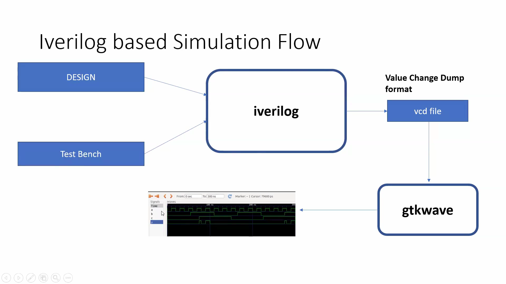

# Day 1 – Introduction to iVerilog, Design and Testbench
**Date:** 09-07-2026

# Objective
Understand the RTL simulation flow using Icarus Verilog (iverilog) and GTKWave, and learn the purpose of Design, Testbench, and Simulation before synthesis

# What is RTL Design?
RTL (Register Transfer Level) Design is the process of describing digital hardware using a Hardware Description Language (HDL) such as Verilog.

RTL defines:
- Inputs
- Outputs
- Internal logic
- Data transfer between registers

The RTL code is later simulated, synthesized, and finally implemented on hardware.

# Why Simulation?
Simulation is performed before synthesis to verify that the RTL behaves according to the design specification.

Benefits:
- Verify functionality
- Detect logical errors
- Reduce debugging time
- Avoid costly hardware errors

# Simulator
A simulator executes the Verilog HDL and predicts how the hardware will behave.

**Simulator used in this workshop:**
- Icarus Verilog (iverilog)

Functions:
- Compiles Verilog source code
- Simulates hardware behavior
- Generates waveform (.vcd) files

# Testbench
A Testbench is a Verilog module used only for verification.

Responsibilities:
- Generates input stimulus (test vectors)
- Applies inputs to the Design Under Test (DUT)
- Observes outputs
- Verifies correct functionality

**Note:** Testbench is **not synthesized** into hardware.

# How the Simulator Works
The simulator continuously monitors changes in the input signals.
Whenever an input changes:
1. The design logic is evaluated.
2. Outputs are updated.
3. Waveforms are generated.

If the inputs do not change, the outputs also remain unchanged.
This is called **event-driven simulation**.

# Testbench Architecture

**Stimulus Generator**
- Generates different input combinations.
**Design (DUT)**
- Actual Verilog module being verified.
**Output Monitor**
- Observes and verifies the outputs

# Icarus Verilog Simulation Flow

## Tools Used
1. Icarus Verilog (iverilog)
Verilog compiler
Simulator
Generates executable simulation file
2. GTKWave
Waveform viewer used to visualize signal transitions.

## Important Files
| File | Purpose |
|------|---------|
| design.v | RTL Design |
| tb_design.v | Testbench |
| simulation.out | Simulation executable |
| dump.vcd | Waveform file |
| GTKWave | Waveform viewer |

## Basic Simulation Flow: 
Write RTL Design
        ->
Write Testbench
        ->
Compile using iverilog
        ->
Run Simulation
        ->
Generate .vcd
        ->
Open in GTKWave
        ->
Verify Outputs

## Key Points
RTL must always be verified before synthesis.
Testbench provides input stimulus.
Testbench is never synthesized.
The simulator reacts only to changes in inputs (event-driven).
GTKWave is used for waveform analysis.
.vcd stores signal transitions during simulation.