# Day 1 – Introduction to iVerilog, Design and Testbench
# What is RTL Design?
 RTL (Register Transfer Level) Design is the process of describing digital hardware using a Hardware Description Language (HDL) such as Verilog.
 RTL defines:
- Inputs
- Outputs
- Internal logic
- Data transfer between registers
The RTL code is later simulated, synthesized, and finally implemented on hardware.

# Why Simulation?
Simulation is performed before synthesis to verify that the RTL behaves according to the design specification.
Benefits:
- Verify functionality
- Detect logical errors
- Reduce debugging time
- Avoid costly hardware errors

# Simulator
A simulator executes the Verilog HDL and predicts how the hardware will behave.
**Simulator used in this workshop:**
- Icarus Verilog (iverilog)
Functions:
- Compiles Verilog source code
- Simulates hardware behavior
- Generates waveform (.vcd) files

# Testbench
A Testbench is a Verilog module used only for verification.
Responsibilities:
- Generates input stimulus (test vectors)
- Applies inputs to the Design Under Test (DUT)
- Observes outputs
- Verifies correct functionality

**Note:** Testbench is **not synthesized** into hardware.

# How the Simulator Works
The simulator continuously monitors changes in the input signals.
Whenever an input changes:
1. The design logic is evaluated.
2. Outputs are updated.
3. Waveforms are generated.
If the inputs do not change, the outputs also remain unchanged.
This is called **event-driven simulation**.

# Testbench Architecture
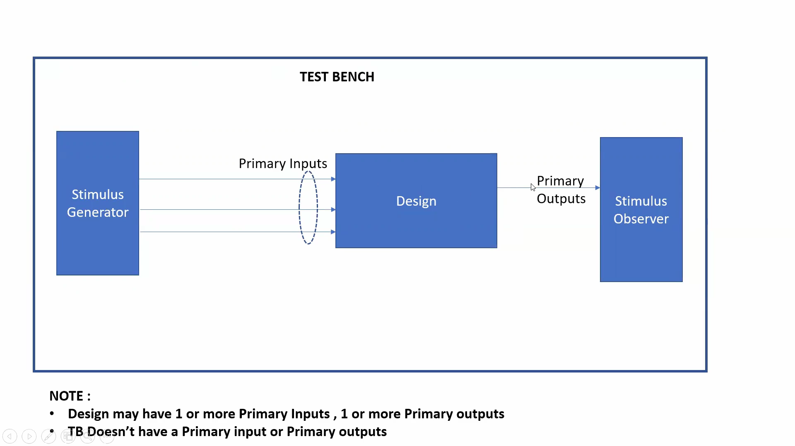
**Stimulus Generator**
- Generates different input combinations.
**Design (DUT)**
- Actual Verilog module being verified.
**Output Monitor**
- Observes and verifies the outputs

# Icarus Verilog Simulation Flow


## Tools Used
1. Icarus Verilog (iverilog)
Verilog compiler
Simulator
Generates executable simulation file
2. GTKWave
Waveform viewer used to visualize signal transitions.

## Important Files
| File | Purpose |
|------|---------|
| design.v | RTL Design |
| tb_design.v | Testbench |
| simulation.out | Simulation executable |
| dump.vcd | Waveform file |
| GTKWave | Waveform viewer |

## Basic Simulation Flow: 
Write RTL Design
        ->
Write Testbench
        ->
Compile using iverilog
        ->
Run Simulation
        ->
Generate .vcd
        ->
Open in GTKWave
        ->
Verify Outputs

# Lab: Simulating a 2-to-1 Multiplexer

### Design Under Test (DUT)
The Design Under Test (DUT) is a **2:1 Multiplexer**.

### Functionality
The multiplexer selects one of two inputs based on the select signal.

Truth Table
| sel | Output (y) |
|-----|------------|
| 0 | i0 |
| 1 | i1 |

Boolean Equation
```text
y = sel ? i1 : i0
```

## Verilog File
- [good_mux.v](../rtl/day01/good_mux/good_mux.v)

## Testbench
The testbench verifies the functionality of the multiplexer by:
- Generating different combinations of inputs.
- Changing the select signal.
- Observing the output.
- Creating a VCD (Value Change Dump) file for waveform analysis.
The testbench itself is **not synthesizable**.
**Testbench:**
- [tb_good_mux.v](../rtl/day01/good_mux/tb_good_mux.v)

### Simulation Flow
```
Verilog Design
       │
       ▼
Testbench
       │
       ▼
Icarus Verilog (iverilog)
       │
       ▼
Simulation (vvp)
       │
       ▼
VCD File
       │
       ▼
GTKWave
       │
       ▼
Waveform Verification
```
## Run Simulation
Execute the compiled simulation.

```bash
vvp a.out
```

or

```bash
./a.out
```

After execution, the simulator generates

```
tb_good_mux.vcd
```
---

## Open GTKWave

```bash
gtkwave tb_good_mux.vcd
```

---
## Waveform
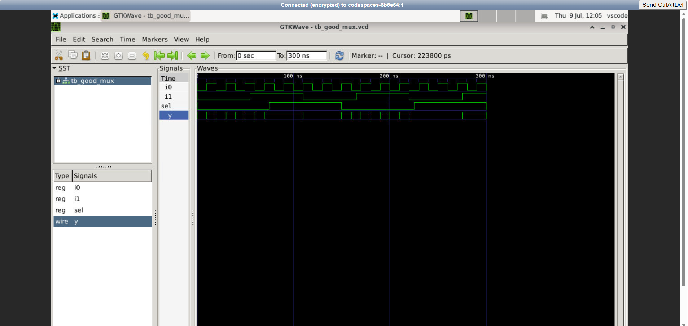
---
### Waveform Analysis
Signals used
- i0 → Input 0
- i1 → Input 1
- sel → Select Signal
- y → Output
Observation
- When **sel = 0**, output follows **i0**.
- When **sel = 1**, output follows **i1**.
This confirms that the multiplexer functions correctly.
---

## Netlist Generation and Reading
#### Step 1: Navigate to the Verilog Files Directory
Open the terminal and move to the directory containing the RTL files.
```bash
cd sky130RTLDesignAndSynthesisWorkshop/verilog_files
```
---
#### Step 2: Launch Yosys
Start the Yosys synthesis tool.
```bash
yosys
```
The terminal prompt changes to:
```text
yosys>
```
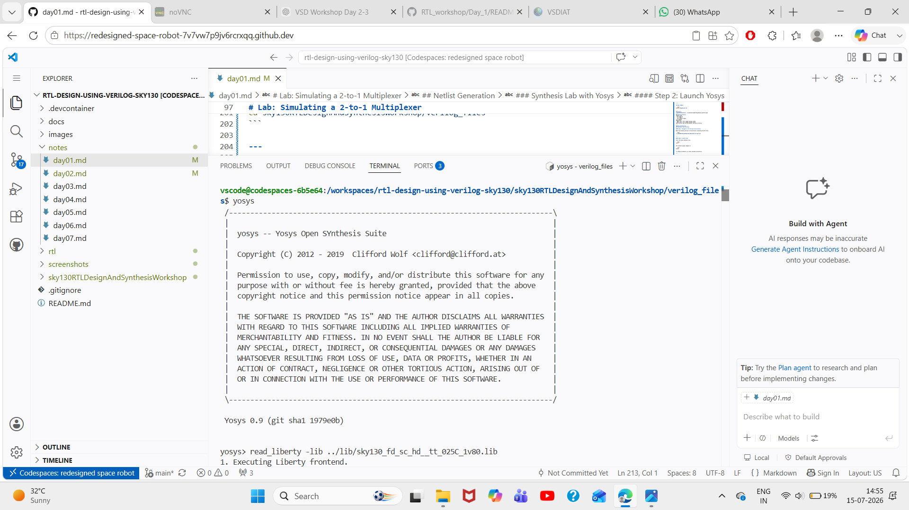
---

#### Step 3: Read the Standard Cell Library
Load the SKY130 standard cell library.
```tcl
read_liberty -lib ../lib/sky130_fd_sc_hd__tt_025C_1v80.lib
```
This library contains the standard cells used for technology mapping.
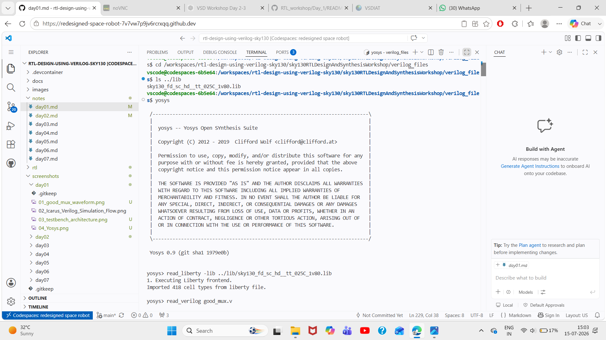
---

#### Step 4: Read the RTL Design
Read the Verilog RTL file into Yosys
```tcl
read_verilog good_mux.v
```
This command imports the RTL description of the 2:1 multiplexer.

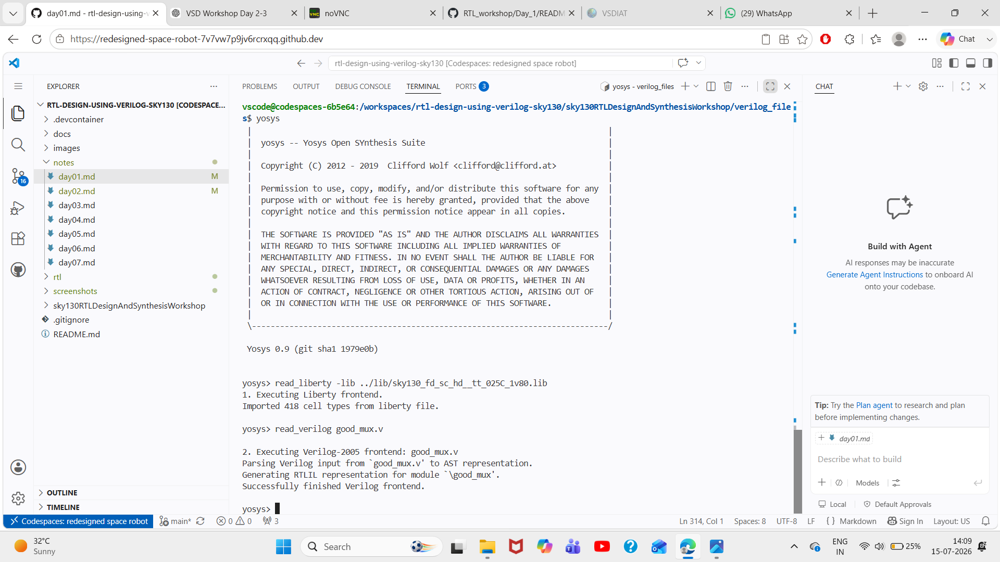
---

#### Step 5: Perform Logic Synthesis
Run the synthesis process.
```tcl
synth -top good_mux
```
This command converts the RTL into an optimized gate-level representation.

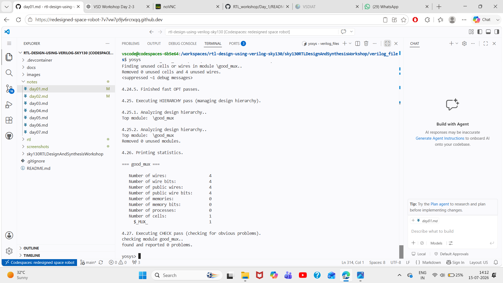
---

#### Step 6: Technology Mapping
Map the synthesized logic to the SKY130 standard cells.
```tcl
abc -liberty ../lib/sky130_fd_sc_hd__tt_025C_1v80.lib
```
This command performs technology mapping using the ABC optimization engine.
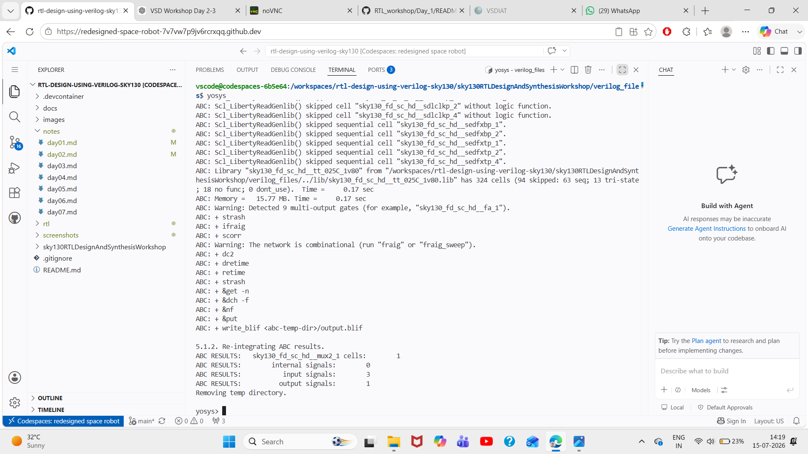
---

#### Step 7: Generate the Gate-Level Netlist
Generate the synthesized gate-level netlist.
```tcl
write_verilog good_mux_netlist.v
```
This creates the technology-mapped Verilog netlist.
---

#### Step 8: Visualize the Gate-Level Netlist
Display the synthesized circuit schematic.
```tcl
show
```
This command opens the synthesized gate-level circuit diagram generated by Yosys.
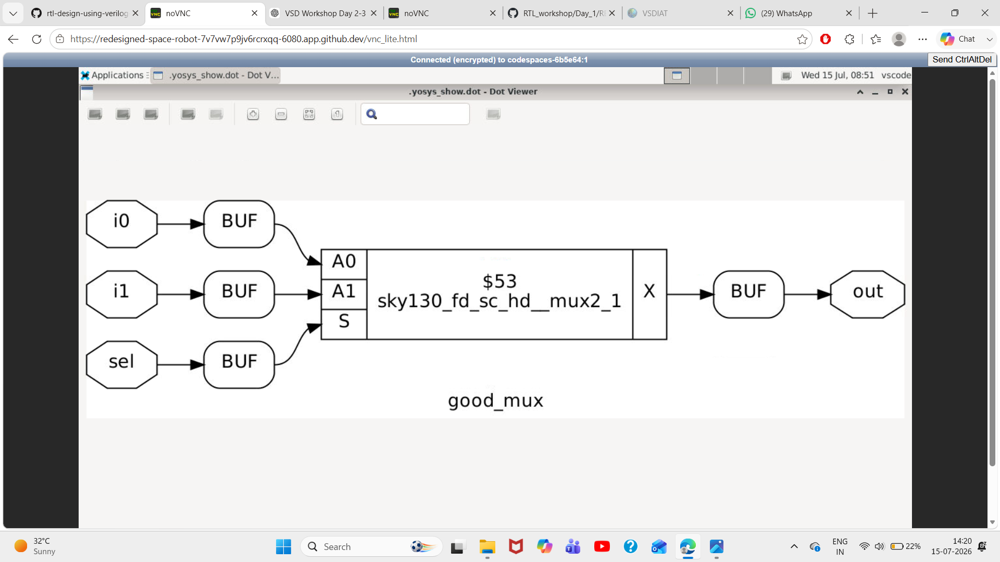
---

#### Step 9: Exit Yosys
```tcl
exit
```
---
## Learning Outcome
- Learned how to edit Verilog source files.
- Learned how to edit testbench files.
- Understood the basic GVim workflow used in the workshop.

# Introduction to Yosys
What is Yosys?
Open-source RTL synthesis tool.
Converts Verilog RTL into a gate-level netlist.
Uses a technology library (.lib) during synthesis.
Generates a synthesized Verilog netlist.


## Yosys Synthesis Flow
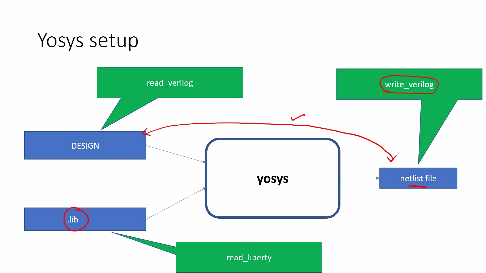

## Important Yosys Commands
| Command                         | Purpose                      |
| ------------------------------- | ---------------------------- |
| `read_verilog design.v`         | Load RTL design              |
| `read_liberty -lib library.lib` | Load standard cell library   |
| `write_verilog netlist.v`       | Generate synthesized netlist |

## Verifying the Synthesized Netlist
After synthesis, the generated netlist is verified using the same testbench that was used for RTL simulation.


## Important Observation
- Primary inputs remain unchanged.
- Primary outputs remain unchanged.
- Internal implementation changes after synthesis.
- The same testbench can be reused for netlist verification.
- RTL and synthesized netlist should produce identical output waveforms.

## Key Learnings
- Yosys is an RTL synthesizer.
- RTL is converted into a gate-level netlist.
- .lib defines the available standard cells.
- read_verilog loads the RTL.
- read_liberty loads the technology library.
- write_verilog generates the synthesized netlist.
- Functional equivalence is verified using Icarus Verilog and GTKWave.

# Editing Verilog and Testbench Files
## Purpose
The RTL design (`good_mux.v`) and the testbench (`tb_good_mux.v`) can be modified using a text editor. In the workshop, **GVim** is used for editing.

## Basic GVim Commands
| Command | Description |
|---------|-------------|
| `gvim good_mux.v` | Open Verilog design |
| `gvim tb_good_mux.v` | Open Testbench |
| `i` | Enter Insert Mode |
| `Esc` | Return to Normal Mode |
| `:w` | Save file |
| `:wq` | Save and Quit |
| `:q!` | Quit without saving |

# Introduction to Logic Synthesis
## RTL Design
RTL (Register Transfer Level) Design is the behavioral representation of a digital circuit written using a Hardware Description Language (HDL) such as **Verilog**.
RTL describes the functionality of the hardware by specifying:
- Inputs and outputs
- Combinational logic
- Sequential logic
- Register transfers
RTL specifies **what the hardware should do**, but it does not describe the physical implementation.

### Example RTL Code
```verilog
module sample_code(
    input clk,
    input rst,
    output result,
    output done
);
always @(posedge clk or posedge rst)
begin
    if(rst)
        ...
    else
        ...
end
endmodule
```

#### Key Points
- RTL is technology independent.
- RTL is generally written in Verilog or VHDL.
- RTL cannot be fabricated directly.
- RTL must be synthesized into logic gates.

> **Figure:** RTL Design represented using Verilog HDL.
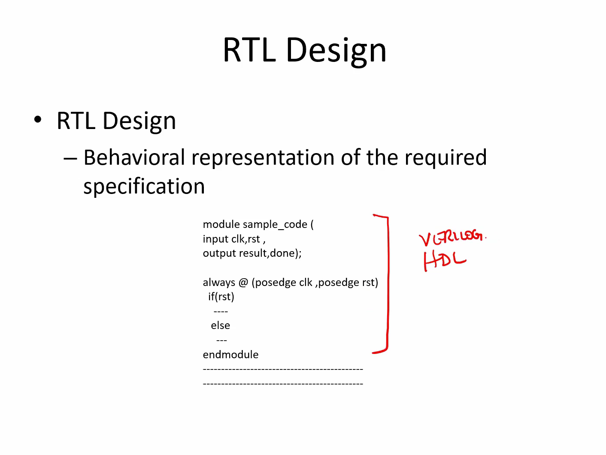
---

## RTL to Digital Logic Circuit
The RTL code is converted into an equivalent Digital Logic Circuit through the synthesis process.
The synthesized circuit performs exactly the same functionality as the RTL description.

### RTL Design Flow
```text
RTL Code
    │
    ▼
Logic Synthesis
    │
    ▼
Digital Logic Circuit
```

### Key Points
- RTL represents circuit behavior.
- Logic synthesis converts RTL into hardware.
- Functional behavior remains unchanged after synthesis.
> **Figure:** RTL Code converted into an equivalent Digital Logic Circuit.
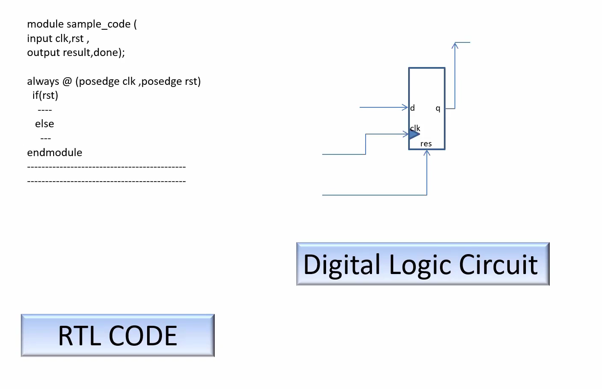
---

## Logic Synthesis
Logic Synthesis is the process of translating RTL code into a technology-specific Gate-Level Netlist using a Standard Cell Library.
During synthesis, the tool performs:
- RTL Parsing
- Logic Optimization
- Technology Mapping
- Gate Connection
- Netlist Generation

### Logic Synthesis Flow
```text
RTL Design
      +
Standard Cell Library (.lib)
      │
      ▼
 Logic Synthesis
      │
      ▼
Gate-Level Netlist
```
The generated Gate-Level Netlist consists of interconnected standard cells that are ready for further physical design steps.

### Key Points
- Converts RTL into logic gates.
- Uses the target technology library.
- Generates a technology-dependent gate-level netlist.
> **Figure:** RTL-to-Gate Level Translation using Logic Synthesis.
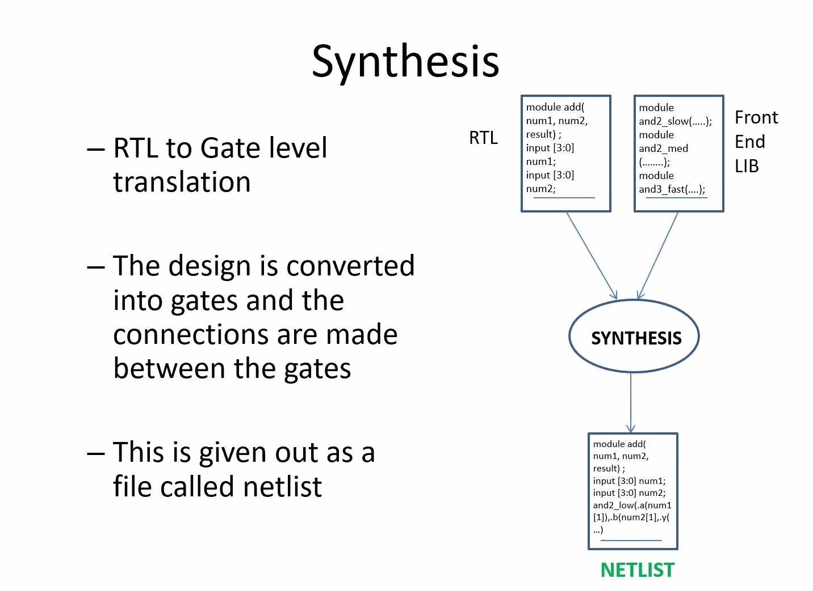
---

## Standard Cell Library (.lib)
A **.lib (Liberty Library)** file contains the standard cells available for a particular semiconductor technology.
The synthesis tool selects cells from this library to implement the RTL design.
The library contains - AND Gates, OR Gates, NAND Gates, NOR Gates, XOR Gates, Buffers, Inverters, Flip-Flops.
Along with their - Timing Information, Area, Power Consumption.

### Different Flavours of Gates
Each logic gate may be available in multiple implementations such as:
- Slow
- Medium
- Fast
Example:
- 2-input AND Gate
  - Slow
  - Medium
  - Fast

- 3-input AND Gate
  - Slow
  - Medium
  - Fast

- 4-input AND Gate
  - Slow
  - Medium
  - Fast
These variants provide different trade-offs between **Speed**, **Area**, and **Power**.

### Key Points
- .lib contains standard cells.
- Includes timing, area, and power information.
- Used during technology mapping.
> **Figure:** Standard Cell Library (.lib) containing different logic gate implementations.
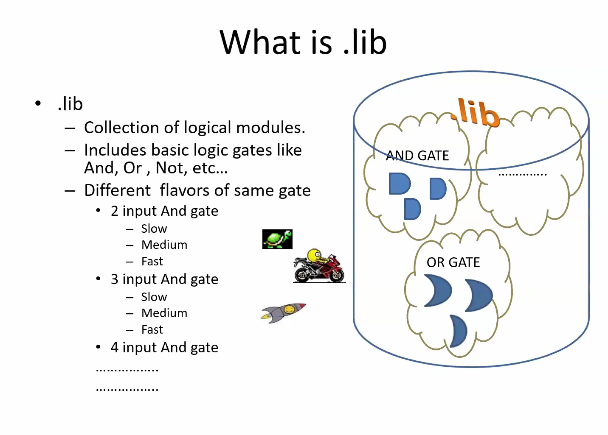
---

## Why Different Flavours of Gates?
The maximum operating frequency of a digital circuit depends on the delay of the combinational logic between two sequential elements.
The setup timing constraint is:
```
Tclk > Tcq + Tcombi + Tsetup
```
where:
- **Tclk** = Clock Period
- **Tcq** = Clock-to-Q Delay
- **Tcombi** = Combinational Logic Delay
- **Tsetup** = Setup Time
The maximum operating frequency is:
```
Fmax = 1 / Tclk(min)
```
To increase the operating frequency, the combinational delay (**Tcombi**) should be minimized.
Fast logic cells reduce delay but generally consume:
- More Area
- More Power
Therefore, synthesis tools choose the most appropriate gate implementation based on timing, area, and power constraints.

### Key Points
- Faster gates reduce combinational delay.
- Faster gates generally consume more power.
- Synthesis balances speed, area, and power.
> **Figure 5:** Timing path illustrating the need for different gate flavours.
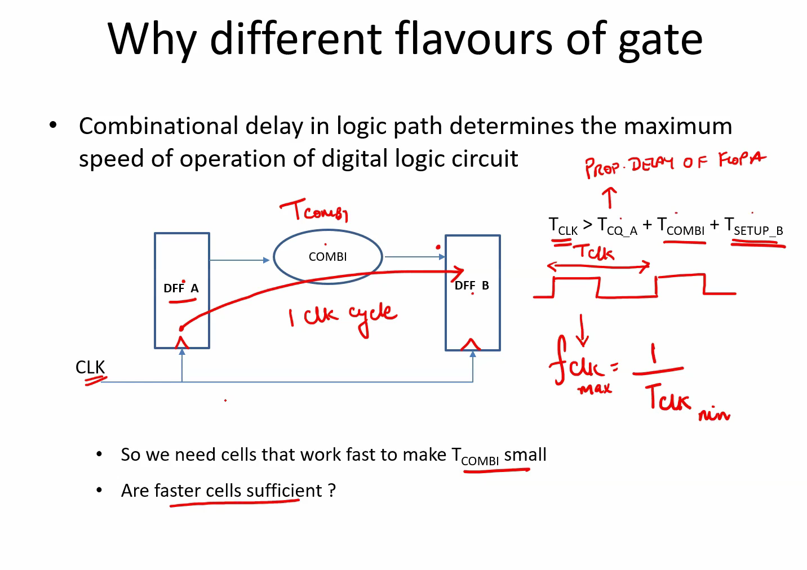
---

## Faster Cells vs Slower Cells
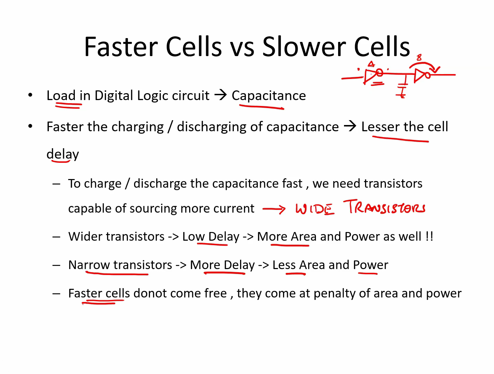
- Every logic gate in a digital circuit drives a load, which is mainly in the form of **capacitance**. The delay of a logic gate depends on how quickly this capacitance is charged and discharged.
- To reduce this delay, the gate must be capable of supplying more current. This is achieved by using **wider transistors** inside the standard cell. Wider transistors charge and discharge the load capacitance more quickly, resulting in lower propagation delay.
- However, faster cells come with a trade-off. Wider transistors occupy more silicon area and consume more power. Therefore, fast cells provide better performance at the cost of increased **area** and **power consumption**.
- In contrast, **narrow transistors** consume less power and occupy less area, but they charge the capacitance more slowly, resulting in higher propagation delay.
**Key Points**
- Wide transistors → Fast cells → Low delay → Higher area and power
- Narrow transistors → Slow cells → Higher delay → Lower area and power

## Why do we need Slow Cells?
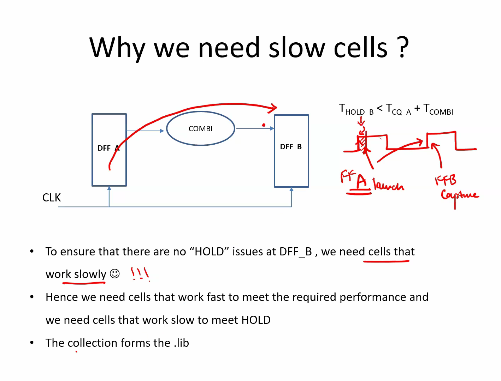
- Using only fast cells is not always beneficial. If the combinational logic becomes too fast, the data may reach the destination flip-flop before its required hold time, causing a **hold time violation**.
- To prevent this problem, slower cells are intentionally used to increase the delay of the combinational path. This ensures that the data remains stable long enough for the receiving flip-flop to capture it correctly.
- Hence, a standard cell library contains both **fast** and **slow** versions of the same logic gates. During synthesis, the tool selects the appropriate cell depending on the timing requirements.
**Key Points**
- Fast cells help satisfy **Setup Timing**.
- Slow cells help satisfy **Hold Timing**.

## Selection of Cells
- The synthesizer selects the most suitable standard cells based on the constraints provided by the designer. Its objective is to achieve the best balance between **performance, area, power, and timing**.
- Using a larger number of fast cells improves the operating speed of the circuit but increases power consumption, chip area, and may introduce hold time violations.
- On the other hand, using more slow cells reduces power consumption and chip area but may prevent the circuit from meeting its required operating frequency.
- Therefore, designers provide **timing constraints** to guide the synthesizer in selecting the optimum combination of fast and slow cells.

## Synthesis Illustration
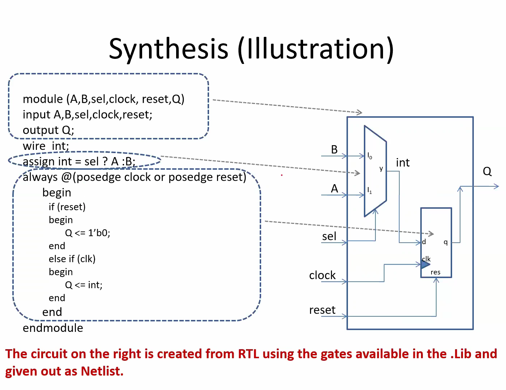
- This example illustrates how RTL code is converted into a digital logic circuit during synthesis.
- The synthesis tool first reads the **RTL code** written in Verilog along with the **Standard Cell Library (.lib)**. It then maps the RTL description to equivalent logic gates and flip-flops available in the library.
- Combinational logic is implemented using standard logic gates such as multiplexers, AND, OR, and NAND gates, while sequential logic is implemented using flip-flops.
- The final output of the synthesis process is a **Gate-Level Netlist**, which represents the complete hardware implementation of the RTL design using standard cells.