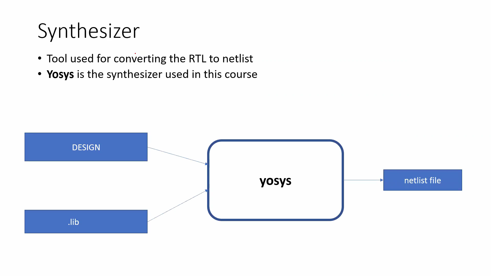
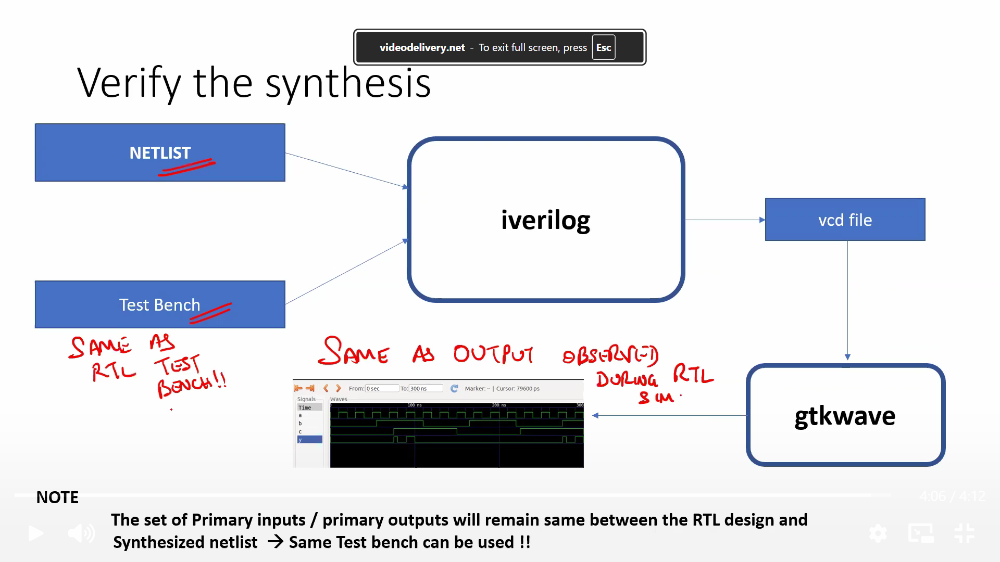

# Day 2 – Good Multiplexer (MUX) Simulation
## Simulation and Verification of a 2:1 Multiplexer using Icarus Verilog and GTKWave

# Objective
- Understand the workflow of RTL simulation.
- Simulate a correct (good) RTL design.
- Verify the functionality of a 2:1 Multiplexer using a testbench.
- Generate and analyze waveform using GTKWave.

# Design Under Test (DUT)
The Design Under Test (DUT) is a **2:1 Multiplexer**.

### Functionality
The multiplexer selects one of two inputs based on the select signal.

Truth Table
| sel | Output (y) |
|-----|------------|
| 0 | i0 |
| 1 | i1 |

Boolean Equation
```text
y = sel ? i1 : i0
```

# Testbench
The testbench verifies the functionality of the multiplexer by:
- Generating different combinations of inputs.
- Changing the select signal.
- Observing the output.
- Creating a VCD (Value Change Dump) file for waveform analysis.
The testbench itself is **not synthesizable**.

# Simulation Flow
```
Verilog Design
       │
       ▼
Testbench
       │
       ▼
Icarus Verilog (iverilog)
       │
       ▼
Simulation (vvp)
       │
       ▼
VCD File
       │
       ▼
GTKWave
       │
       ▼
Waveform Verification
```
# Run Simulation
Execute the compiled simulation.

```bash
vvp a.out
```

or

```bash
./a.out
```

After execution, the simulator generates

```
tb_good_mux.vcd
```
---

# Open GTKWave

```bash
gtkwave tb_good_mux.vcd
```

---
# Waveform

---
## Waveform Analysis
Signals used
- i0 → Input 0
- i1 → Input 1
- sel → Select Signal
- y → Output

Observation
- When **sel = 0**, output follows **i0**.
- When **sel = 1**, output follows **i1**.
This confirms that the multiplexer functions correctly.
---

# Verification Result
The RTL design behaves exactly according to the multiplexer truth table.
The waveform confirms that:
- Output changes whenever inputs or select signal changes.
- Output always follows the selected input.
- RTL implementation is correct.
---

# Key Learnings
- RTL designs are verified using simulation before synthesis.
- Testbench generates input stimulus.
- Icarus Verilog compiles and executes Verilog code.
- Simulation produces a VCD waveform file.
- GTKWave is used to visualize signal transitions.
- Waveform verification confirms the correctness of RTL functionality.
---
# Editing Verilog and Testbench Files
## Purpose
The RTL design (`good_mux.v`) and the testbench (`tb_good_mux.v`) can be modified using a text editor. In the workshop, **GVim** is used for editing.

## Basic GVim Commands
| Command | Description |
|---------|-------------|
| `gvim good_mux.v` | Open Verilog design |
| `gvim tb_good_mux.v` | Open Testbench |
| `i` | Enter Insert Mode |
| `Esc` | Return to Normal Mode |
| `:w` | Save file |
| `:wq` | Save and Quit |
| `:q!` | Quit without saving |

## Learning Outcome
- Learned how to edit Verilog source files.
- Learned how to edit testbench files.
- Understood the basic GVim workflow used in the workshop.


# Introduction to Yosys
What is Yosys?
Open-source RTL synthesis tool.
Converts Verilog RTL into a gate-level netlist.
Uses a technology library (.lib) during synthesis.
Generates a synthesized Verilog netlist.


## Yosys Synthesis Flow


## Important Yosys Commands
| Command                         | Purpose                      |
| ------------------------------- | ---------------------------- |
| `read_verilog design.v`         | Load RTL design              |
| `read_liberty -lib library.lib` | Load standard cell library   |
| `write_verilog netlist.v`       | Generate synthesized netlist |

## Verifying the Synthesized Netlist
After synthesis, the generated netlist is verified using the same testbench that was used for RTL simulation.


## Important Observation
- Primary inputs remain unchanged.
- Primary outputs remain unchanged.
- Internal implementation changes after synthesis.
- The same testbench can be reused for netlist verification.
- RTL and synthesized netlist should produce identical output waveforms.

## Key Learnings
- Yosys is an RTL synthesizer.
- RTL is converted into a gate-level netlist.
- .lib defines the available standard cells.
- read_verilog loads the RTL.
- read_liberty loads the technology library.
- write_verilog generates the synthesized netlist.
- Functional equivalence is verified using Icarus Verilog and GTKWave.