# Day 2 - Timing libs, hierarchical vs flat synthesis and efficient flop coding styles.
## Understanding Timing Libraries (.lib Files)

In this session, I learned about the importance of timing library (.lib) files used during synthesis. These files contain all the information required by the synthesis tool to map RTL designs into standard cells. I explored different sections of the library file and understood how each section contributes to timing, power, and area estimation during synthesis.
---

## Understanding the Library Name
Example:
```text
sky130_fd_sc_hd__tt_025C_1v80.lib
```
The naming convention provides useful information about the library.
- **sky130** → SkyWater 130 nm technology
- **fd** → Foundry Design
- **sc** → Standard Cell Library
- **hd** → High Density library
- **tt** → Typical Process Corner
- **025C** → Operating Temperature (25°C)
- **1v80** → Supply Voltage (1.8 V)
---

## Delay Model
- The library uses a **Lookup Table (LUT)** based delay model.
- Instead of calculating delay using equations, the delay values are pre-characterized and stored in lookup tables. During synthesis, the tool refers to these tables to estimate delays based on input transition time and output load.
---

## Units Defined in the Library
The timing library defines standard units used throughout the synthesis process.
- Time → ns
- Voltage → V
- Current → mA
- Resistance → kΩ
- Capacitance → pF
- Power → nW
These units ensure consistency while calculating timing and power.
---

## Operating Conditions
The operating condition section specifies the environment in which the library has been characterized.
It includes:
- Process Corner
- Supply Voltage
- Temperature
These parameters directly affect the timing and power characteristics of the circuit.
---

## Standard Cell Information
Each standard cell has its own entry inside the library file. Every cell definition contains important information such as:
- Cell name
- Area
- Leakage power
- Pin information
- Timing data
- Cell functionality
- Power characteristics
This information is used by the synthesis tool during technology mapping.
---

## Leakage Power
Leakage power is specified for every possible input combination of a standard cell. Since different input combinations produce different leakage values, the library stores all of them. The synthesis tool uses these values while estimating the static power of the design.
---

## Understanding Cell Functionality
Each standard cell has an equivalent Verilog behavioral model. By opening the corresponding Verilog model, I understood how the cell performs its logic operation. This helps in verifying the functionality of standard cells during simulation.
---

## Comparing Different Cell Flavours
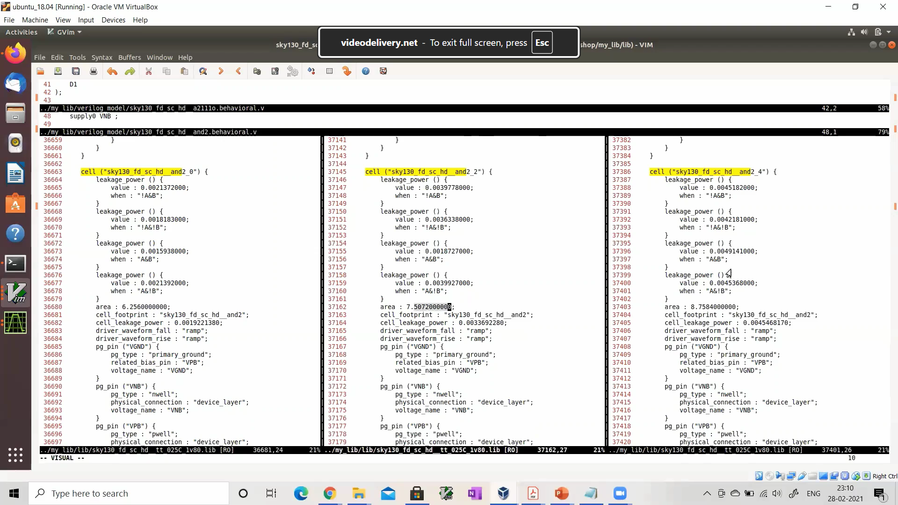
The same logic function can have multiple implementations with different area, power, and delay characteristics.
For example:
- and2_0
- and2_2
- and2_4
Although all perform the same 2-input AND operation, their performance differs.

### Smaller Cell
- Lower area
- Lower power
- Higher delay

### Larger Cell
- Higher area
- Higher power
- Lower delay

The synthesis tool selects the appropriate cell depending on the timing and area constraints of the design.
---

## Key Learnings
- Understood the structure of a timing library (.lib) file.
- Learned how to interpret the library naming convention.
- Understood Lookup Table (LUT) based delay models.
- Explored the different units defined inside the library.
- Learned about operating conditions used for library characterization.
- Examined standard cell definitions.
- Understood leakage power information for different input combinations.
- Explored the Verilog behavioral model of standard cells.
- Compared different flavours of the same standard cell based on area, power, and delay.
---
write_verilog multiple_modules_hier.v

# Hierarchical Synthesis using Yosys
## Step 1 - Launch Yosys
### Command
```bash
yosys
```
---
### Description
This command launches the Yosys synthesis tool and opens the interactive Yosys shell.
---

### Observation
- Yosys starts successfully.
- The prompt changes from
```bash
$
```
to

```bash
yosys>
```
indicating that Yosys is ready to accept synthesis commands.
---

### Key Learning
Yosys is an open-source RTL synthesis tool that converts Verilog RTL into a gate-level representation.
---

### Screenshot
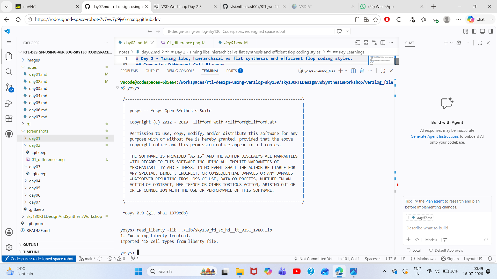

## Step 2 - Load the Standard Cell Library
### Command
```tcl
read_liberty -lib ../lib/sky130_fd_sc_hd__tt_025C_1v80.lib
```
---

### Description
This command loads the Sky130 standard cell library into Yosys.
The Liberty (.lib) file contains:
- Standard cells
- Logic gate definitions
- Timing information
- Area information
- Power information
These cells are used during technology mapping.
---

### Observation
Yosys successfully imports all standard cells from the Liberty file.
---

### Key Learning
Technology mapping cannot be performed without loading the target standard cell library.
---

### Screenshot
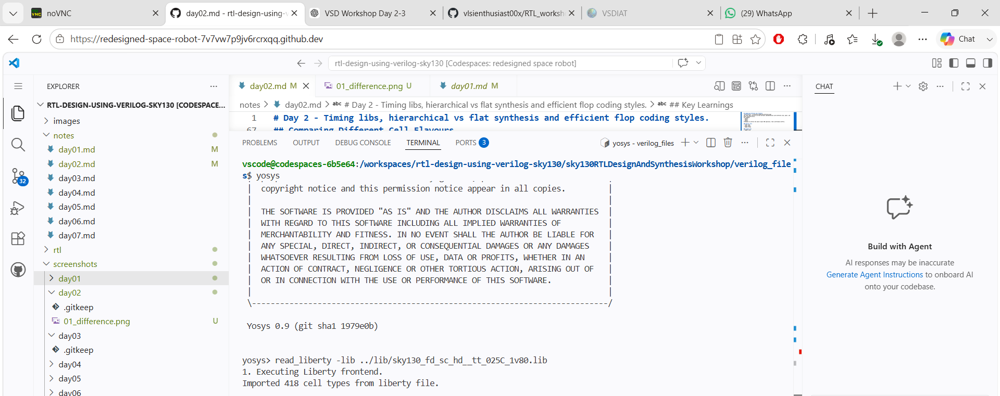

## Step 3 - Read the Verilog RTL
### Command
```tcl
read_verilog multiple_modules.v
```
---

### Description
This command imports the RTL design into Yosys.
Yosys parses the Verilog code and creates an internal RTLIL representation.
---

### Observation
The following modules are recognized:
- sub_module1
- sub_module2
- multiple_modules
---

### Key Learning
Yosys converts Verilog RTL into an internal representation before synthesis.
---synth -top multiple_modules
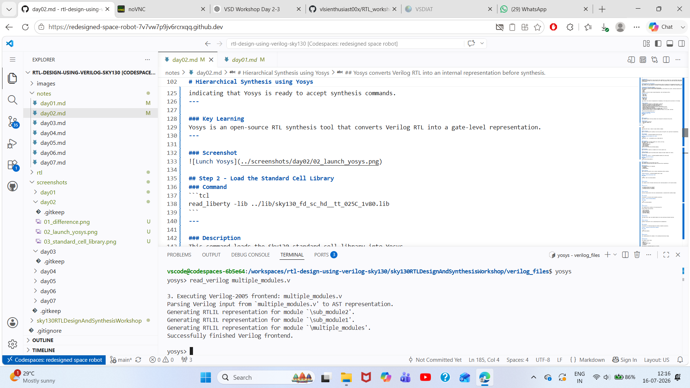

## Step 4 - Perform Hierarchical Check
### Command
```tcl
hierarchy -check -top multiple_modules
```
---

### Description
This command verifies the module hierarchy and sets **multiple_modules** as the top-level module.
---

### Observation
- All module instances are resolved.
- No hierarchy errors are reported.
- The design hierarchy is displayed.
---

### Key Learning
Hierarchy checking ensures that every instantiated module is available before synthesis begins.
---

### Screenshot
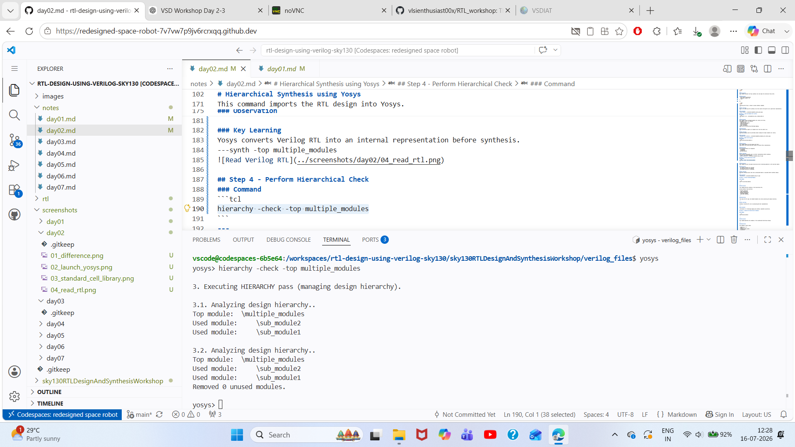

## Step 5 - Perform Technology Mapping
### Command

```tcl
synth -top multiple_modules
```
---

### Description
This command performs synthesis of the hierarchical RTL.
During synthesis Yosys performs:
- Process conversion
- Logic optimization
- Boolean optimization
- Technology mapping
- Gate-level synthesis
---

### Observation
Yosys maps the RTL logic into Sky130 standard cells while preserving the module hierarchy.
---

### Key Learning
Synthesis transforms RTL into an optimized gate-level implementation.
---
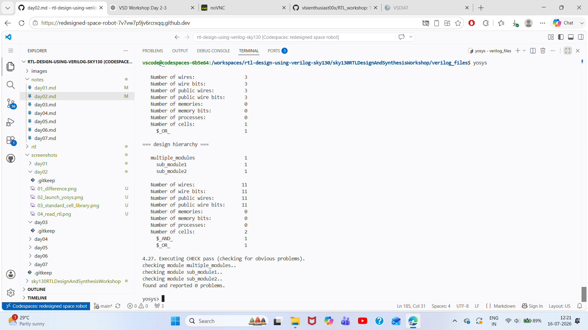

## Step 6 - Generate the Hierarchical Schematic
### Command
```tcl
show multiple_modules
```
---

### Description
This command generates the schematic of the synthesized hierarchical design.
---

### Observation
The schematic clearly shows:
- Inputs (a, b, c)
- Output (y)
- Internal signal (net1)
- sub_module1
- sub_module2
The hierarchy is preserved exactly as in the RTL.
---

### Key Learning
The schematic confirms that the synthesized design still maintains the original module hierarchy.
---
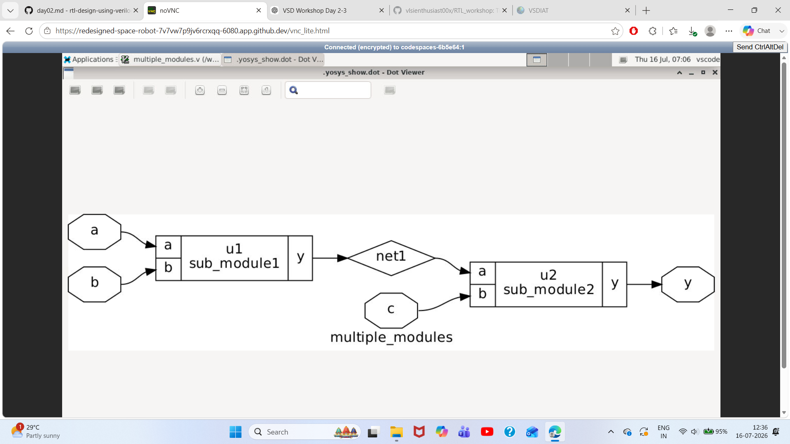

## Step 7 - Export the Hierarchical Netlist
### Command
```tcl
write_verilog multiple_modules_hier.v
```
---

### Description
This command writes the synthesized hierarchical gate-level netlist into a Verilog file.
---

### Observation
Yosys creates the file
```text
multiple_modules_hier.v
```
which contains the synthesized hierarchical implementation.
---

### Key Learning
The synthesized design can be exported as a Verilog netlist for simulation, verification, or further physical design.
---
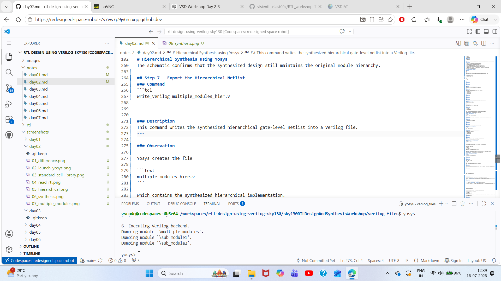

## Step 8 - Viewing the Hierarchical Netlist
### Command
```tcl
!gvim multiple_modules_hier.v
```
---

### Description
The synthesized hierarchical Verilog netlist is opened using GVim for inspection.
This file (`multiple_modules_hier.v`) is generated by Yosys after hierarchical synthesis. It preserves the original module hierarchy while replacing the RTL implementation inside each module with synthesized logic.
---

### Observations
- The top module (`multiple_modules`) is retained.
- The submodules (`sub_module1` and `sub_module2`) are still instantiated.
- The internal signal `net1` is preserved.
- Source code references are included as comments, making it easier to trace the synthesized netlist back to the original RTL.
- The hierarchy of the design remains unchanged.
---

### Understanding the Netlist
The file begins with:
```verilog
module multiple_modules(a, b, c, y);
```
This indicates that the original top-level module has been preserved.
The module instances are still visible:

```verilog
sub_module1 u1 (...);
sub_module2 u2 (...);
```

This confirms that the synthesis was performed in **hierarchical mode**, where each module is synthesized independently without flattening the design.
---

### Key Learning
Hierarchical synthesis preserves the original module structure of the design. This makes debugging, verification, and maintenance easier while allowing each module to be synthesized separately.
---
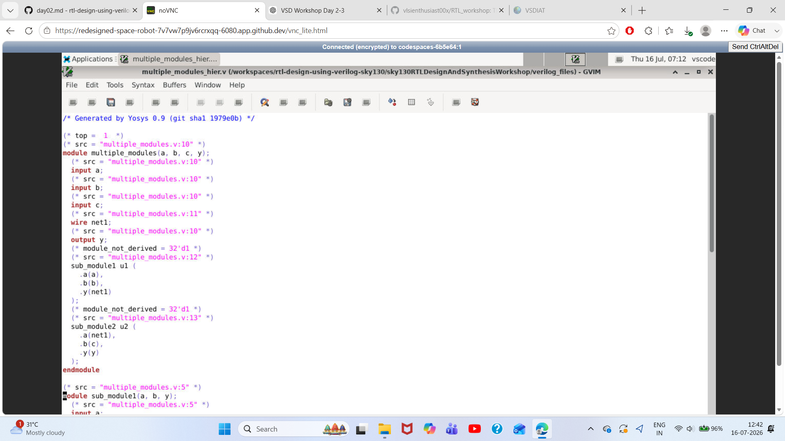

# Module Level Synthesis (Submodule Synthesis)
Module-level synthesis synthesizes only the selected module instead of the complete design hierarchy. This allows designers to verify, optimize, and debug individual modules independently before integrating the complete design.
---

## Step 1 - Load the Standard Cell Library
### Command
```tcl
read_liberty -lib ../lib/sky130_fd_sc_hd__tt_025C_1v80.lib
```

## Step 2 - Read the Verilog RTL Design
### Command
```tcl
read_verilog multiple_modules.v
```

## Step 3 - Synthesize Only `sub_module1`
### Command
```tcl
synth -top sub_module1
```
### Description
Synthesizes only the **sub_module1** block while removing all unused modules from the design.

### Observation
- Performs hierarchy analysis.
- Removes unused modules.
- Optimizes the selected module.
- Generates an intermediate synthesized netlist.

### Screenshot
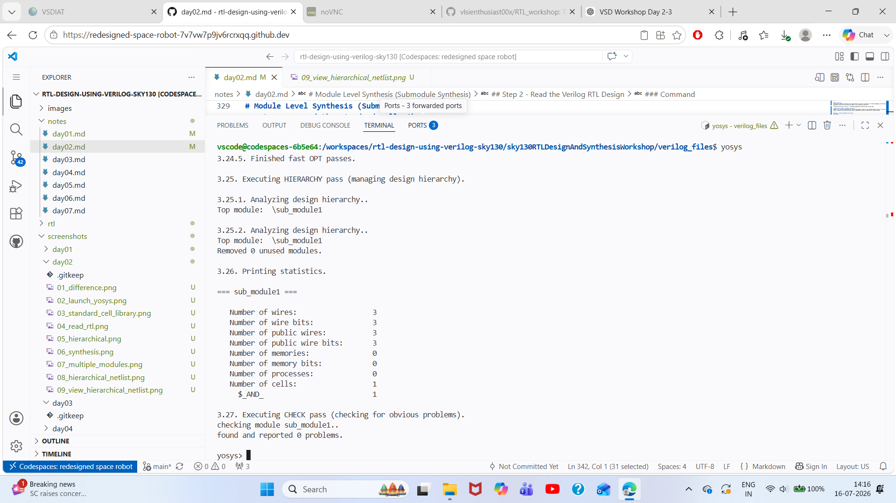
---

## Step 5 - Perform Technology Mapping
### Command
```tcl
abc -liberty ../lib/sky130_fd_sc_hd__tt_025C_1v80.lib
```

### Description
Maps the synthesized logic to the Sky130 standard cell library using the ABC mapper.

### Observation
The generic AND logic is replaced with the corresponding Sky130 standard cell.

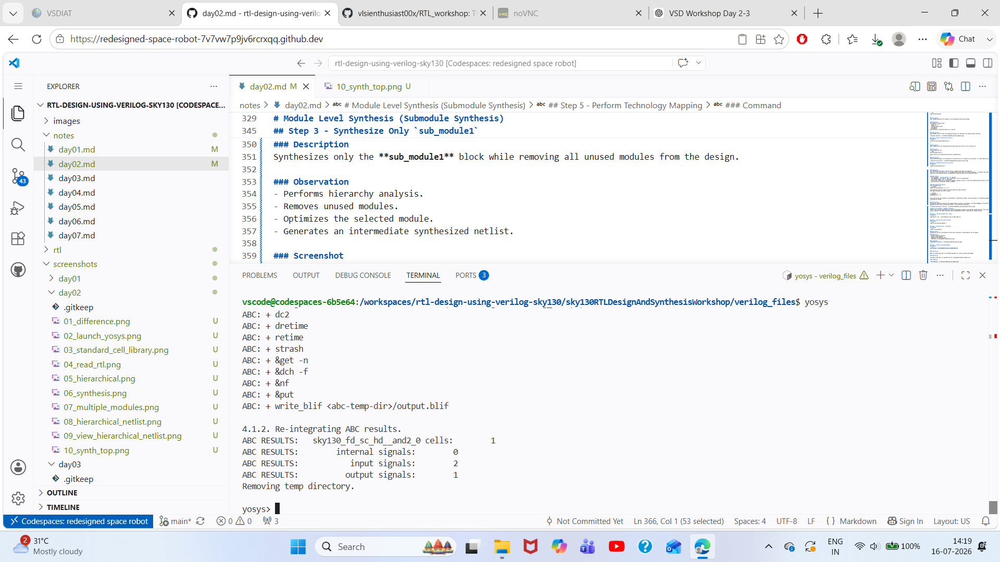
---

## Step 6 - Display the Gate-Level Circuit
### Command
```tcl
show
```

### Description
Displays the synthesized gate-level schematic of **sub_module1**.

### Observation
The schematic contains:
- Two input buffers
- One Sky130 AND gate
- One output buffer
Only **sub_module1** is synthesized, while all other modules are removed.
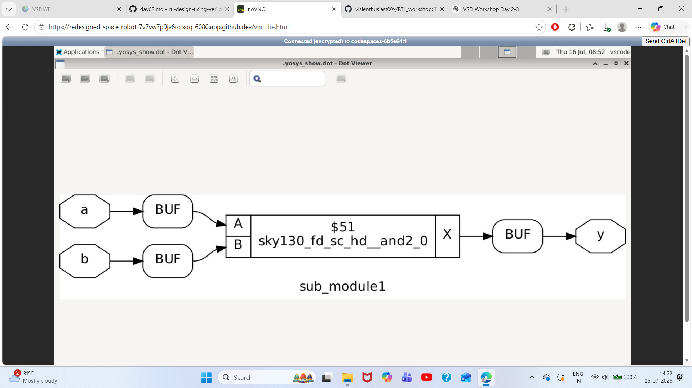
---

## Key Learnings
- `synth -top` synthesizes only the specified module.
- Unused modules are automatically removed from the design hierarchy.
- Module-level synthesis simplifies debugging and verification of individual blocks.
- `abc` maps generic logic into technology-specific standard cells.
- `show` provides a graphical gate-level representation of the synthesized module.
- Module-level synthesis is useful for validating the functionality and optimization of individual RTL blocks before full-chip synthesis.
---

# Various Flop Coding Styles and Optimization
## Objective
The objective of this session is to understand different coding styles of D Flip-Flops (DFFs) in Verilog and learn the difference between synchronous and asynchronous reset/set signals. We also study how synthesis tools implement these coding styles in hardware.
---

## D Flip-Flop with Asynchronous Reset
### Verilog Code
```verilog
module dff_asyncres(
    input clk,
    input async_reset,
    input d,
    output reg q
);
always @(posedge clk or posedge async_reset)
begin
    if(async_reset)
        q <= 1'b0;
    else
        q <= d;
end
endmodule
```
### Explanation
- The sensitivity list contains both `posedge clk` and `posedge async_reset`.
- Whenever `async_reset` becomes HIGH, the output immediately becomes `0`.
- The clock is **not required** for reset.
- Therefore, this is called an **Asynchronous Reset**.
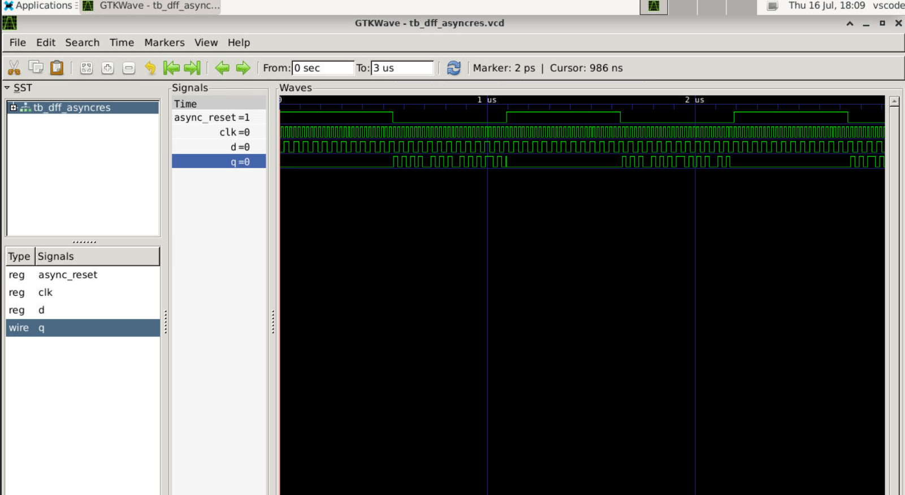

## D Flip-Flop with Asynchronous Set
### Verilog Code
```verilog
module dff_async_set(
    input clk,
    input async_set,
    input d,
    output reg q
);

always @(posedge clk or posedge async_set)
begin
    if(async_set)
        q <= 1'b1;
    else
        q <= d;
end

endmodule
```

### Explanation
- Similar to asynchronous reset.
- Whenever `async_set` becomes HIGH, output becomes `1`.
- Clock edge is not required.


## D Flip-Flop with Synchronous Reset
### Verilog Code
```verilog
module dff_syncres(
    input clk,
    input sync_reset,
    input d,
    output reg q
);
always @(posedge clk)
begin
    if(sync_reset)
        q <= 1'b0;
    else
        q <= d;
end
endmodule
```

### Explanation
- The sensitivity list contains only `posedge clk`.
- Even if `sync_reset` becomes HIGH, output changes only on the next clock edge.
- Hence it is called **Synchronous Reset**.
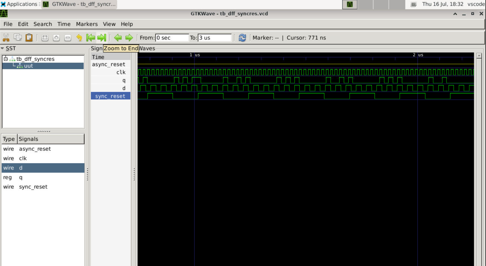

## Asynchronous Reset
### Working
An asynchronous reset is directly connected to the reset pin of the flip-flop.
Whenever reset becomes HIGH,
```
Q = 0
```
immediately.
Clock is completely ignored.

### Advantages
- Immediate reset
- Used during power-on reset
- Faster response

### Disadvantages
- Difficult timing closure
- Improper reset release can cause metastability

## Synchronous Reset
### Working
Synchronous reset is implemented using a multiplexer before the D input.
```
           Reset
             |
             |
        +-----------+
D ----->|           |
0 ------>|   MUX    |----> DFF ----> Q
        +-----------+
             |
          Clock
```
When
```
reset = 1
```
MUX selects
```
0
```
Otherwise,
```
MUX selects D
```
The flip-flop captures the selected value only on the next clock edge.

### Advantages
- Easier timing analysis
- Preferred in ASIC design
- Better synthesis optimization

### Disadvantages
- Reset waits for clock edge
- Extra combinational logic is required

##  Hardware Comparison
### Asynchronous Reset
```
Reset
   |
   |
+-------+
|  DFF  |
+-------+
```
Dedicated reset pin.
Immediate operation.
---

### Synchronous Reset
```
Reset
   |
  MUX
   |
+-------+
|  DFF  |
+-------+
```
Reset is implemented through combinational logic.

### Comparison Table
| Feature | Asynchronous Reset | Synchronous Reset |
|----------|--------------------|-------------------|
| Clock Required | No | Yes |
| Reset Action | Immediate | Next Clock Edge |
| Sensitivity List | `posedge clk or posedge reset` | `posedge clk` |
| Hardware | Dedicated Reset Pin | MUX before D input |
| Speed | Faster | Slower |
| Timing Analysis | Difficult | Easier |
---

#### Commands Used
No Linux commands were used in this session. This topic is purely conceptual and focuses on Verilog coding styles and hardware implementation.
---

