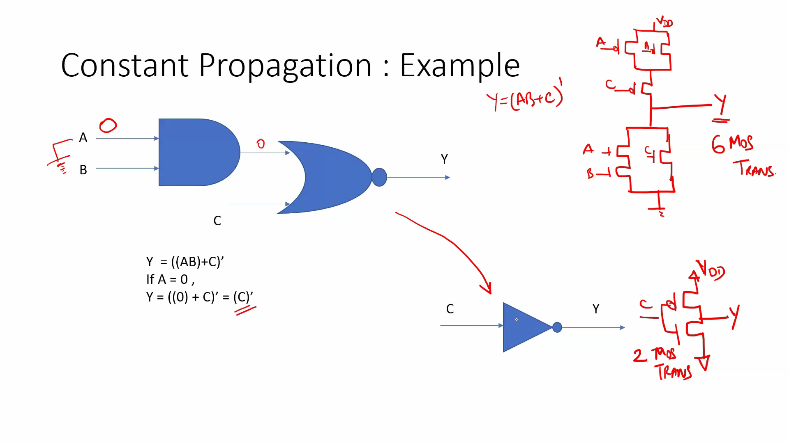
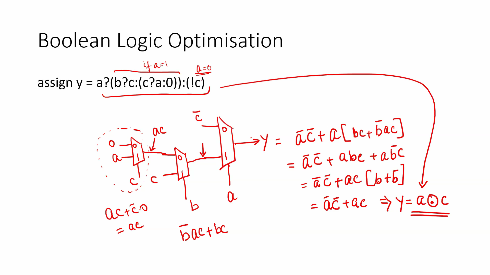
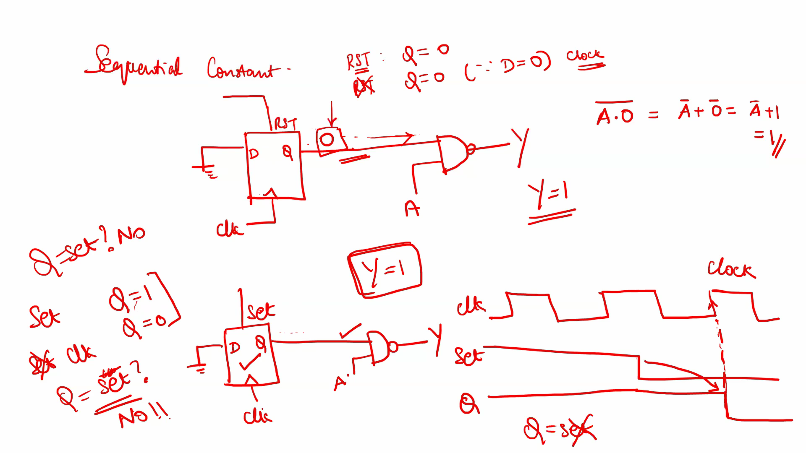
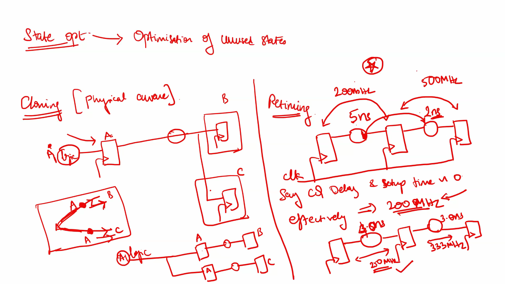

# Day-3: Introduction to Logic Optimisations
## Why Logic Optimization?
During synthesis, the RTL description is transformed into a gate-level implementation. Before mapping the design to standard cells, the synthesis tool tries to simplify the logic without changing its functionality.
The main goals of logic optimization are:
- Reduce silicon area
- Reduce power consumption
- Improve circuit performance
- Remove unnecessary logic
- Simplify the Boolean expressions
---

## Types of Logic Optimization
Logic optimization can be broadly classified into:
1. Combinational Logic Optimization
2. Sequential Logic Optimization

## Combinational Logic Optimization
Combinational logic optimization focuses only on combinational circuits. The output depends only on the current inputs and not on previous states.
The two commonly used optimization techniques are:
- Constant Propagation
- Boolean Logic Optimization
These techniques reduce unnecessary gates, thereby saving area and power.
---

## Constant Propagation
Constant propagation is a direct optimization technique in which the synthesis tool identifies signals that always have a constant value (`0` or `1`) and simplifies the circuit accordingly.
Instead of implementing the complete logic, the synthesis tool replaces the constant values and removes redundant gates.
### Example
Consider the logic expression
```
Y = ((AB) + C)'
```
If
```
A = 0
```
then
```
AB = 0
```
Therefore,
```
Y = (0 + C)'
```
which simplifies to
```
Y = C'
```
As a result:
- The AND gate becomes unnecessary.
- The NOR gate is replaced by a simple inverter.
- The transistor count reduces significantly.
- Area and power consumption decrease.

---

## Boolean Logic Optimization
Boolean logic optimization simplifies complex Boolean expressions using Boolean algebra identities.
The synthesis tool automatically performs these simplifications during optimization.

### Example
Original expression
```verilog
assign y = a ? (b ? c : (c ? a : 0)) : (!c);
```
After applying Boolean algebra, the expression simplifies to
```
Y = A XNOR C
```
The optimized implementation requires much less hardware compared to the original logic.
Benefits include:
- Reduced number of logic gates
- Lower transistor count
- Reduced propagation delay
- Lower power consumption

---

## Sequential Logic Optimization
Unlike combinational optimization, sequential optimization considers the memory elements (flip-flops and latches) in the design.
The optimization depends on both the present inputs and the previous state of the circuit.
Sequential optimization can be classified into:

### Basic
- Sequential Constant Propagation

### Advanced
- State Optimization
- Retiming
- Sequential Logic Cloning (Floorplan-Aware Synthesis)
---

### Sequential Constant Propagation
Sequential constant propagation extends the concept of constant propagation to sequential circuits.
For example, if a flip-flop is permanently held in the reset state, its output always remains
```
Q = 0
```
Similarly, if a flip-flop output is always fixed due to constant inputs, the synthesis tool propagates this constant throughout the design and removes unnecessary logic.
This optimization reduces:
- Logic gates
- Flip-flop usage
- Area
- Power consumption

---

## Advanced Sequential Optimizations
### State Optimization
State optimization removes redundant or unreachable states from a finite state machine (FSM), reducing the amount of hardware required.
---

### Sequential Logic Cloning
Sequential logic cloning creates multiple copies of a logic block to reduce routing delay and improve timing. It is mainly used during physical design when floorplanning information is available.
---

### Retiming
Retiming improves the maximum operating frequency by moving flip-flops across combinational logic without changing the functionality of the circuit.
For example:
- Original combinational delay = 5 ns
- Maximum frequency = 200 MHz
After retiming:
- Logic delay is redistributed.
- Long paths become balanced.
- Maximum frequency increases (for example, to approximately 333 MHz).
Retiming improves timing performance without changing the logical behavior of the circuit.

---

# Key Learnings
- Logic optimization reduces hardware while preserving functionality.
- Combinational optimization includes constant propagation and Boolean logic optimization.
- Constant propagation removes logic driven by constant values.
- Boolean optimization simplifies logic using Boolean algebra.
- Sequential optimization considers memory elements along with combinational logic.
- Retiming improves circuit speed by redistributing flip-flops.
- Logic cloning improves timing by reducing routing delays.
- State optimization removes unnecessary FSM states to reduce hardware.