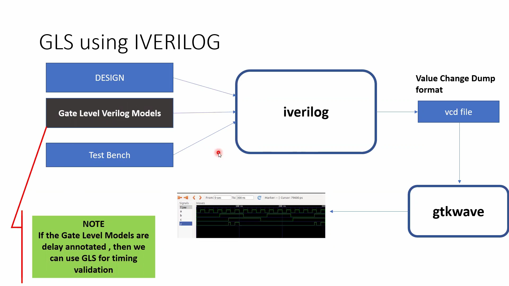
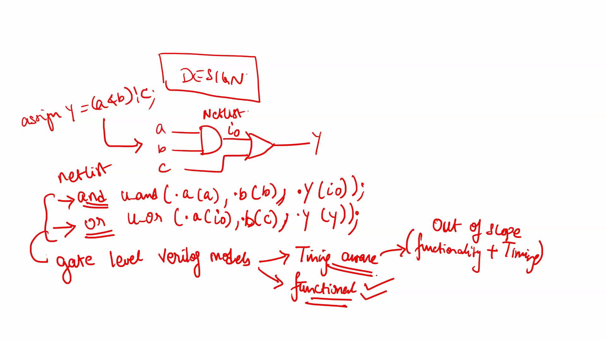
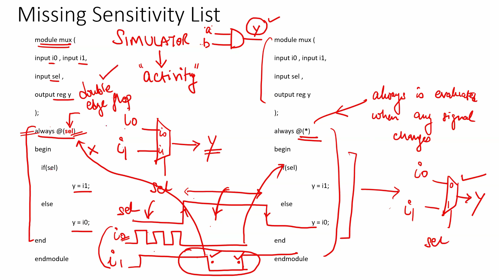
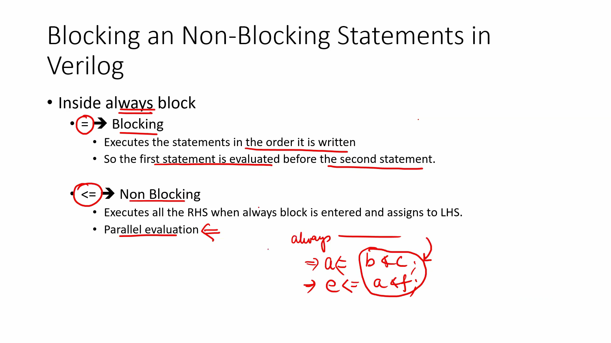

# Day 4 - Introduction to Gate Level Simulation (GLS) and Synthesis–Simulation Mismatches
##  What is Gate Level Simulation (GLS)?
Gate Level Simulation (GLS) is the process of simulating the synthesized gate-level netlist instead of the original RTL code.
During RTL simulation, the simulator executes the Verilog code written by the designer. After synthesis, the RTL is converted into a gate-level netlist consisting of standard cells such as AND, OR, NAND, NOR gates and Flip-Flops.
In GLS, the same testbench is reused, but the Design Under Test (DUT) is replaced with the synthesized gate-level netlist. This ensures that synthesis has preserved the intended functionality of the RTL design.

## Why Gate Level Simulation?
Gate Level Simulation is mainly performed for two purposes:

### Functional Verification
- Verifies that the synthesized netlist behaves exactly like the RTL design.
- Detects any functionality changes introduced during synthesis.

### Timing Verification
- Verifies setup and hold timing requirements after delay information (SDF) is added.
- In this workshop, only functional GLS is discussed.
---

#### Key Points
- RTL is Behavioral Verilog.
- Synthesis converts RTL into Gate-Level Netlist.
- Same Testbench is reused.
- Only the DUT changes.
---

## 2. GLS Flow using Icarus Verilog
The complete GLS flow is shown below.
```text
RTL Design
     │
     ▼
Synthesis
     │
     ▼
Gate-Level Netlist
     │
     ▼
Gate-Level Verilog Models
     │
     ▼
iverilog Compiler
     │
     ▼
VCD File
     │
     ▼
GTKWave
```
Explanation:
- The synthesized gate-level netlist becomes the DUT.
- Standard cell gate models are included during compilation.
- Icarus Verilog compiles the design and generates a VCD waveform file.
- GTKWave is used to visualize the waveform.
If delay information is included in the gate models, GLS can also perform timing verification.
---

---

## Gate-Level Netlist
Consider the RTL code below.
```verilog
assign y = (a & b) | c;
```
After synthesis, the logic is converted into gate instances.
Example:
```verilog
and U1(i0, a, b);
or  U2(y, i0, c);
```
Although the representation changes, the functionality remains exactly the same.
RTL → Behavioral Description
↓
Netlist → Gate-Level Connections
The simulator now executes gate instances instead of behavioral Verilog statements.
---

---

## Synthesis–Simulation Mismatch
Sometimes RTL simulation produces correct results, but the synthesized hardware behaves differently.
This situation is known as a **Synthesis–Simulation Mismatch**.
The most common causes are:
- Missing Sensitivity List
- Blocking Assignments
- Non-Blocking Assignments
- Non-Standard Verilog Coding
These issues may not be visible during RTL simulation but become apparent after synthesis or during Gate Level Simulation.

## Missing Sensitivity List
Consider the following code.
```verilog
always @(sel)
```
Only **sel** is included in the sensitivity list.
If **i0** or **i1** changes while **sel** remains unchanged, the always block is not executed. Consequently, the output does not update correctly, leading to incorrect RTL simulation.
Correct coding style:
```verilog
always @(*)
```
or
```systemverilog
always_comb
```
These automatically include all signals used inside the always block, ensuring correct combinational behavior.
---


## 6. Blocking vs Non-Blocking Assignments
Two assignment operators are commonly used inside always blocks.

## Blocking Assignment (=)
Characteristics:
- Executes sequentially.
- Statements execute one after another.
- Mostly used in combinational logic.

Example:
```verilog
a = b;
c = a;
```
Here, **c** receives the updated value of **a** immediately.
---

## Non-Blocking Assignment (<=)
Characteristics:
- Evaluates all RHS expressions first.
- Updates all LHS variables simultaneously.
- Mimics actual hardware behavior.
- Used for sequential circuits.

Example:
```verilog
a <= b;
c <= a;
```
Both assignments occur simultaneously at the clock edge.
---
#

# 7. Problems with Blocking Assignments
Suppose two Flip-Flops are connected in series.
Expected Hardware:
```text
D → FF1 → FF2
```
If blocking assignments are used:
```verilog
q0 = d;
q = q0;
```
Both statements execute immediately.
As a result, **q** receives the new value of **d** in the same clock cycle instead of the previous value of **q0**.
This does not represent actual hardware behavior.
Correct implementation:
```verilog
q0 <= d;
q  <= q0;
```
Now,
- q0 captures d.
- q captures the previous value of q0.
- Hardware behavior and simulation match perfectly.
---
#

# 8. Another Blocking Assignment Example
Consider the following code.
```verilog
y = q0 & c;
q0 = a | b;
```
During simulation, **y** uses the old value of **q0** because it is evaluated before q0 is updated.
However, synthesis optimizes the logic into:
```text
y = (a | b) & c
```
Therefore,
Simulation:
- Uses old q0.

Synthesized Hardware:
- Uses the latest value of q0
This creates a synthesis–simulation mismatch.
Using proper coding style eliminates this issue.
---

---
# Key Learnings
- Gate Level Simulation verifies the synthesized design.
- The same testbench is reused for RTL and GLS.
- GLS replaces the RTL with the synthesized gate-level netlist.
- Functional GLS checks logical correctness.
- Timing GLS additionally checks setup and hold timing.
- Always use `always @(*)` for combinational logic.
- Use blocking (`=`) assignments for combinational logic.
- Use non-blocking (`<=`) assignments for sequential logic.
- Incorrect coding styles can result in synthesis–simulation mismatches.
---